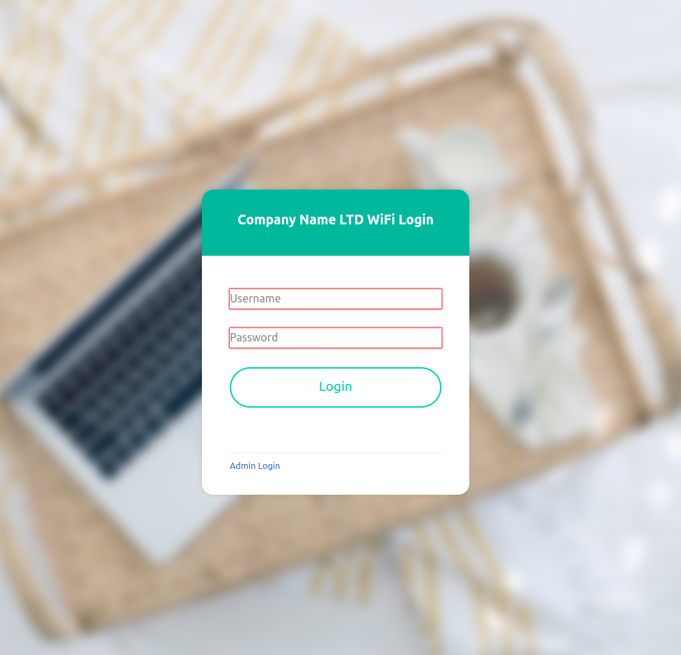
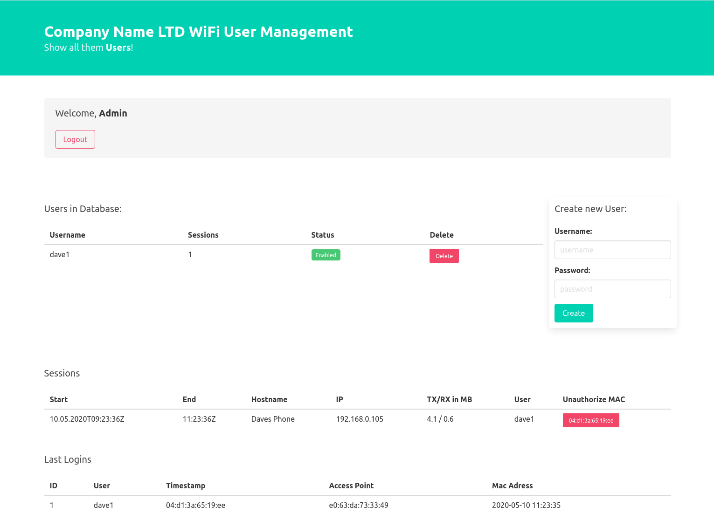

# P0rtality - UniFi compatible Captive Portal

## Features

* Add & Remove Users
* COMING SOON - Easy way to use existing user database
* Get live Sessions of logged in Users
* Kick logged in Users
* basic session logging
* docker support

## Facts & Structure
* nginx & PHP runs Front- and Backend
* Mysql stores users, passwords and session-history
* conf/config.php contains most settings

## Compatibilty
tested on Unifi
 * 5.12.35
 * 5.12.66

## Installation

### Docker
* adapt **src/conf/config.php** BEFORE proceeding!
    * 
* run **run.compose.sh**
* set IP of UniFi-Guest-Portal to the IP of your Docker-Host. (Unfi-Controller "Guest Conrol" - enable - "external Portal" - set IP)

#### Testing
* Portal is available at <IP>/guest/s/default/

nginx config, conf/config.php and all web-content is mounted in **volumes/nginx** afterwards.

### Manual Installation
* Make the contents of the **src**-folder available via web server. The root directory (where the .php files live) must be accessible under <domain/IP>/guest/s/default/. PHP is needed. 
* Prevent direct access to the directories **html** and **config**! 
* import **.build/import_db.sql** into a **Medoo** compatible database. 
* adapt **conf/config.php**.
 
## Credits
this project uses 
* Medoo for DB-Access (http://medoo.in/)
* parts of the UniFi API browser for Unifi-Controller API Logic (https://github.com/Art-of-WiFi/UniFi-API-browser)

and is inspired by
* espresso-portal (https://github.com/emanuelepaiano/espresso-portal)